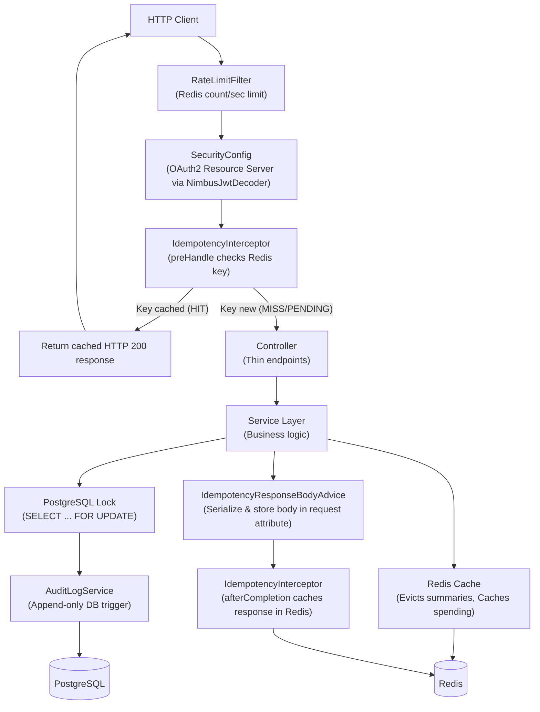

# LedgerCore — Digital Banking API

[](https://github.com/purvathota/digital-banking-api/actions/workflows/ci.yml) | **Live Demo:** [Swagger UI](https://ledgercore-production.up.railway.app/swagger-ui.html)

A production-quality Digital Banking REST API built with modern Java. Designed for portfolio-grade fintech applications with zero compromises on security, concurrency safety, or code quality.

**Live API:** https://ledgercore-production.up.railway.app/swagger-ui.html

## Tech Stack

| Layer | Technology |
|---|---|
| **Language** | Java 21 |
| **Framework** | Spring Boot 3.4.x |
| **Security** | Spring Security + OAuth2 Resource Server + JWT (HMAC-SHA256) |
| **Database** | PostgreSQL 16 |
| **Caching** | Redis 7 |
| **Migrations** | Flyway |
| **API Docs** | Springdoc OpenAPI (Swagger UI) |
| **Containers** | Docker + Docker Compose |
| **CI/CD** | GitHub Actions |
| **Testing** | JUnit 5 + Mockito + H2 |

## Quick Start

### Prerequisites

- Docker and Docker Compose installed

### Run with Docker Compose

```bash
docker-compose up --build
```

Once started, open:
- **Swagger UI**: [http://localhost:8080/swagger-ui.html](http://localhost:8080/swagger-ui.html)
- **API Docs**: [http://localhost:8080/v3/api-docs](http://localhost:8080/v3/api-docs)

### Environment Variables

| Variable | Default | Description |
|---|---|---|
| `DB_USERNAME` | `ledger` | PostgreSQL username |
| `DB_PASSWORD` | `ledger` | PostgreSQL password |
| `JWT_SECRET` | *(dev default)* | HMAC-SHA256 signing key (min 32 chars) |
| `REDIS_HOST` | `localhost` | Redis hostname |

## Architecture



### Request Flow

1. **RateLimitFilter** — Checks per-user rate limit (5 req/s) via Redis counter. Returns 429 if exceeded.
2. **Spring Security (OAuth2 Resource Server)** — Validates JWT Bearer tokens from the Authorization header via a `NimbusJwtDecoder` using HMAC-SHA256.
3. **IdempotencyInterceptor (preHandle)** — Intercepts transaction requests. If the idempotency key is already cached in Redis, it short-circuits and returns the cached response immediately.
4. **Controller** — Thin layer with OpenAPI annotations. Delegates immediately to service.
5. **Service** — All business logic. Manages transactions, locking, audit logging, cache eviction, and budget alerts.
6. **Repository** — Spring Data JPA with custom `@Lock(PESSIMISTIC_WRITE)` queries for row-level locking.
7. **PostgreSQL** — SERIALIZABLE isolation + SELECT FOR UPDATE prevents race conditions. Enforces append-only audit_log table.
8. **Redis** — Used for response caching (monthly summaries, 1h TTL), rate limiting (fixed-window counter), and idempotency keys (24h TTL).

## API Endpoints

| Method | Path | Auth | Description |
|---|---|---|---|
| `POST` | `/api/auth/register` | ❌ | Register a new user |
| `POST` | `/api/auth/token` | ❌ | Login and get JWT |
| `POST` | `/api/accounts` | ✅ | Create a new account |
| `GET` | `/api/accounts` | ✅ | List all accounts |
| `POST` | `/api/accounts/{id}/deposit` | ✅ | Deposit funds (idempotent) |
| `POST` | `/api/accounts/{id}/withdraw` | ✅ | Withdraw funds |
| `POST` | `/api/transfers` | ✅ | Transfer between accounts (idempotent) |
| `GET` | `/api/accounts/{id}/transactions` | ✅ | Paginated transaction history |
| `GET` | `/api/accounts/{id}/summary/monthly` | ✅ | Monthly spending summary (cached) |
| `POST` | `/api/budgets` | ✅ | Set monthly budget per category |
| `GET` | `/api/budgets/{accountId}` | ✅ | List budgets for an account |

## Design Decisions

### 1. Concurrent Transfer Safety
When users initiate transfers concurrently, two separate operations could read the same account balance and attempt to deduct funds simultaneously, leading to negative balances. LedgerCore protects against this by forcing the database to process transactions strictly in order. We acquire exclusive row-level locks on the participating accounts using database-level locking and always lock them in ascending order of their IDs. This lock order prevents mutual waiting, completely eliminating deadlocks under high volume.

### 2. Idempotent API Operations
When a network timeout occurs, clients cannot know if their payment or deposit completed successfully. If they retry, they risk duplicate processing or double charges. LedgerCore solves this by using client-provided unique idempotency keys processed by a servlet interceptor. The first request locks the key as pending and processes the transaction, caching the successful result in Redis for 24 hours. Duplicate requests with the same key are caught at the entry point and immediately returned the cached response without running the transaction again.

### 3. Append-Only Auditing
For regulatory compliance, banking systems must maintain a tamper-evident history of account balances to reconstruct financial records at any point in time. LedgerCore guarantees audit integrity by using a database trigger on the audit table that actively raises an error and rejects any attempt to update or delete rows. Any modification is impossible even if someone has direct database access, enforcing an immutable, append-only history of every financial movement.

## Running Tests

```bash
# Unit tests (no external dependencies needed)
./mvnw test

# The test profile uses:
# - H2 in-memory database (no PostgreSQL required)
# - Redis auto-configuration disabled
# - Flyway disabled (schema created by Hibernate)
```

## Project Structure

```
src/main/java/com/ledgercore/
├── LedgerCoreApplication.java          # Spring Boot entry point
├── config/                             # Security, JWT, Redis, OpenAPI configuration
├── controller/                         # REST controllers (zero business logic)
├── dto/
│   ├── request/                        # Inbound DTOs with @Valid annotations
│   └── response/                       # Outbound DTOs with @Schema annotations
├── entity/                             # JPA entities mapped to database tables
├── enums/                              # AccountType, TransactionType, TransactionCategory
├── exception/                          # Custom exceptions + global @RestControllerAdvice
├── filter/                             # Rate limiting servlet filter
├── repository/                         # Spring Data JPA repositories
├── service/                            # Business logic layer
└── validation/                         # Custom @MonetaryAmount validator
```

## License

MIT
