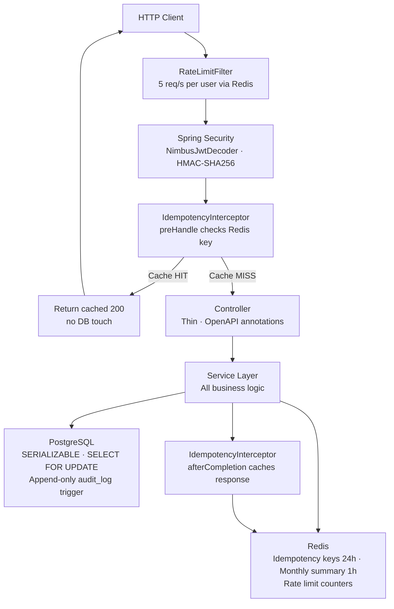

<div align="center">
  <h1>LedgerCore — Digital Banking API</h1>
  <p>A production-quality digital banking backend with real financial domain logic, concurrency safety, idempotent payment processing, and a tamper-proof audit trail.</p>

  
  
  
  
  
  

  [](https://github.com/purvathota/digital-banking-api/actions/workflows/ci.yml)
</div>

---

## 🌐 Live Demo & Documentation

| Resource | Link |
| :--- | :--- |
| **Live Swagger UI** | [https://digital-banking-api-production-fdad.up.railway.app/swagger-ui.html](https://digital-banking-api-production-fdad.up.railway.app/swagger-ui.html) |
| **API Docs (JSON)** | [https://digital-banking-api-production-fdad.up.railway.app/v3/api-docs](https://digital-banking-api-production-fdad.up.railway.app/v3/api-docs) |
| **Deployment** | GitHub Actions → Railway |

---

## 💡 Why I Built This

Most banking API portfolio projects are basic CRUD apps with a token slapped on top. They skip the problems that actually matter in production fintech — concurrent balance updates, duplicate payment prevention, and tamper-proof audit trails.

LedgerCore is built around the three problems every fintech engineer gets asked about in interviews:

- **What happens when two transfers hit the same account at the same time?**
- **What happens when a network timeout leaves you unsure if a payment went through?**
- **How do you prove a transaction happened exactly as recorded?**

This project answers all three with production-grade implementations — not workarounds.

---

## 🚀 Platform Capabilities

- ✓ **Multi-account management** — CURRENT and SAVINGS account types per user
- ✓ **Deposits, withdrawals, and account-to-account transfers**
- ✓ **Concurrent transfer safety** — SERIALIZABLE isolation + SELECT FOR UPDATE + ordered locking
- ✓ **Idempotency keys** — Redis SET NX prevents duplicate charges on retries
- ✓ **Per-user rate limiting** — 5 requests/second enforced via Redis sliding window
- ✓ **Append-only audit log** — PostgreSQL trigger blocks all UPDATE and DELETE operations
- ✓ **Spending categorisation** — GROCERIES, TRANSPORT, ENTERTAINMENT, BILLS, OTHER
- ✓ **Monthly spend summaries** — Redis-cached with 1-hour TTL, evicted on new transactions
- ✓ **Budget alerts** — Automatic threshold notifications at 80% of monthly budget
- ✓ **OAuth2 Resource Server + JWT** — Stateless authentication via NimbusJwtDecoder
- ✓ **Full OpenAPI documentation** — Live Swagger UI with example requests and error responses
- ✓ **GitHub Actions CI/CD** — Tests run on every push before Railway deployment

---

## 🏗️ Architecture Summary

| Layer | Technologies |
| --- | --- |
| **Language** | Java 21 |
| **Framework** | Spring Boot 3.4 · Spring Security · Spring Data JPA |
| **Security** | OAuth2 Resource Server · JWT (HMAC-SHA256) · NimbusJwtDecoder |
| **Database** | PostgreSQL 16 · Flyway migrations |
| **Cache / Rate Limiting / Idempotency** | Redis 7 |
| **API Documentation** | Springdoc OpenAPI · Swagger UI |
| **Containers** | Docker · Docker Compose |
| **CI/CD** | GitHub Actions → Railway |
| **Testing** | JUnit 5 · Mockito · H2 |

---

## 🗺️ Request Flow



### Request Lifecycle

1. **RateLimitFilter** — Checks per-user rate limit (5 req/s) via Redis counter. Returns 429 if exceeded.
2. **Spring Security** — Validates JWT Bearer token via `NimbusJwtDecoder` using HMAC-SHA256. Extracts user UUID from `sub` claim.
3. **IdempotencyInterceptor (preHandle)** — If the `Idempotency-Key` header is present and cached in Redis, short-circuits and returns the cached response immediately without touching the database.
4. **Controller** — Thin layer with OpenAPI annotations. Delegates immediately to service.
5. **Service** — All business logic. Manages transactions, locking, audit logging, cache eviction, and budget alerts.
6. **Repository** — Spring Data JPA with custom `@Lock(PESSIMISTIC_WRITE)` queries for row-level locking.
7. **PostgreSQL** — SERIALIZABLE isolation + SELECT FOR UPDATE prevents race conditions. Append-only audit_log enforced by database trigger.
8. **Redis** — Monthly summary cache (1h TTL), rate limit counters, and idempotency key store (24h TTL).

---

## 🔌 API Reference

| Method | Endpoint | Auth | Description |
|---|---|---|---|
| POST | `/api/auth/register` | ❌ | Register a new user |
| POST | `/api/auth/token` | ❌ | Login · returns signed JWT |
| POST | `/api/accounts` | ✅ | Create a bank account |
| GET | `/api/accounts` | ✅ | List all accounts |
| POST | `/api/accounts/{id}/deposit` | ✅ | Deposit funds · idempotent |
| POST | `/api/accounts/{id}/withdraw` | ✅ | Withdraw funds |
| POST | `/api/transfers` | ✅ | Transfer between accounts · idempotent |
| GET | `/api/accounts/{id}/transactions` | ✅ | Paginated transaction history |
| GET | `/api/accounts/{id}/summary/monthly` | ✅ | Monthly spend by category · Redis cached |
| POST | `/api/budgets` | ✅ | Set a monthly budget per category |
| GET | `/api/budgets/{accountId}` | ✅ | List budgets for an account |

Full request/response examples, error codes, and schema definitions are in the live Swagger UI.

---

## ⚙️ Engineering Decisions

### 1. Concurrent Transfer Safety

Two simultaneous transfers involving the same account could both read the same balance and produce an incorrect result. LedgerCore prevents this with `@Transactional(isolation = SERIALIZABLE)` and `SELECT FOR UPDATE` row-level locking on both accounts before any balance operation. Accounts are always locked in ascending UUID order regardless of transfer direction — this eliminates circular-wait deadlocks entirely under any load.

### 2. Idempotency Keys

A network timeout does not mean a transaction failed — it may have succeeded. Without idempotency, a client retry creates a duplicate charge. LedgerCore implements idempotency at the servlet interceptor level using Redis `SET NX`. The first request atomically claims the key, processes the transaction, and caches the full response for 24 hours. Every subsequent request with the same key is short-circuited at the interceptor and returned the cached result without touching the database. This is how Stripe, Revolut, and every production payments API works.

### 3. Append-Only Audit Log

Regulated financial systems must be able to reconstruct the exact state of any account at any point in time. Mutating audit records destroys that capability. LedgerCore enforces immutability at the database level using a PostgreSQL trigger that raises an exception on any `UPDATE` or `DELETE` against the `audit_log` table — making modification impossible even with direct database access.

### 4. Redis for Three Separate Concerns

Redis serves three distinct roles: rate limiting (fixed-window counters per user per second), idempotency key storage (SET NX with 24-hour TTL), and monthly summary caching (1-hour TTL with transaction-level cache eviction). Keeping all three in Redis avoids additional infrastructure while making the performance characteristics of each concern explicit and independently tunable.

### 5. OAuth2 Resource Server over Custom JWT Filter

Rather than writing a custom `OncePerRequestFilter` for JWT validation, LedgerCore uses Spring Security's built-in OAuth2 Resource Server with `NimbusJwtDecoder`. This handles token expiry, signature verification, and claim extraction correctly out of the box — and signals to anyone reading the code that the security layer follows the spec rather than a home-rolled implementation.

---

## 🛡️ Security Architecture

- **Authentication** — Stateless HMAC-SHA256 signed JWT tokens issued on login
- **Authorization** — Account ownership verified on every request; no user can access another user's accounts
- **Rate Limiting** — Maximum 5 requests per second per authenticated user on all transaction endpoints
- **Input Validation** — `@Valid` Bean Validation on all request DTOs with a custom `@MonetaryAmount` validator rejecting negative values, values above 1,000,000, and values with more than 2 decimal places
- **Global Error Handling** — `@RestControllerAdvice` standardises all errors into consistent JSON; internal stack traces never leak to clients

---

## 📊 Live Verification Results

Verified against the running Railway deployment:

| Test | Result |
|---|---|
| Register + JWT login | ✅ HS256 token issued |
| Deposit with idempotency key | ✅ Processed once |
| Duplicate deposit same key | ✅ Cached response returned · balance unchanged |
| 6th rapid request in 1 second | ✅ HTTP 429 returned |
| UPDATE on audit_log table | ✅ PostgreSQL trigger blocked with exception |
| DELETE on audit_log table | ✅ PostgreSQL trigger blocked with exception |

---

## 💻 Local Development

### Prerequisites

- Docker and Docker Compose

### Run locally

```bash
docker-compose up --build
```

### Environment Variables

| Variable | Description |
|---|---|
| `PGHOST` | PostgreSQL host |
| `PGPORT` | PostgreSQL port |
| `PGDATABASE` | Database name |
| `PGUSER` | Database user |
| `PGPASSWORD` | Database password |
| `REDIS_URL` | Redis connection URL |
| `JWT_SECRET` | HMAC-SHA256 signing key (minimum 32 characters) |

---

## 🧪 Running Tests

```bash
./mvnw test
```

Tests use H2 in-memory database. No external dependencies required.

---

## 📁 Project Structure

src/main/java/com/ledgercore/

├── LedgerCoreApplication.java

├── config/          # Security, JWT, Redis, OpenAPI

├── controller/      # REST layer — zero business logic

├── dto/

│   ├── request/     # Inbound DTOs with @Valid annotations

│   └── response/    # Outbound DTOs with @Schema annotations

├── entity/          # JPA entities

├── enums/           # AccountType · TransactionType · TransactionCategory

├── exception/       # Custom exceptions · @RestControllerAdvice

├── filter/          # RateLimitFilter

├── interceptor/     # IdempotencyInterceptor · IdempotencyResponseBodyAdvice

├── repository/      # Spring Data JPA · @Lock(PESSIMISTIC_WRITE) queries

├── service/         # Business logic

└── validation/      # @MonetaryAmount custom validator

---

## 📈 Lessons Learned

1. **Idempotency is harder than it looks** — The naive check-then-set approach has a race condition. Using Redis `SET NX` for atomic check-and-set was the key insight. Handling concurrent requests during processing required a PENDING state and polling pattern.

2. **Profile activation in cloud environments** — Railway doesn't activate Spring profiles the same way Docker Compose does. Debugging this taught me exactly how Spring Boot property resolution works at runtime and why environment variable injection order matters.

3. **Database-level vs application-level enforcement** — The audit log trigger was the most important design decision. Application-level protection can be bypassed by anyone with database access. A PostgreSQL trigger cannot. The distinction matters in regulated environments.

4. **OAuth2 Resource Server vs custom filters** — Using `NimbusJwtDecoder` with Spring's built-in OAuth2 Resource Server eliminated an entire class of subtle JWT validation bugs that custom filter implementations commonly introduce.

5. **Redis serving multiple concerns** — Using Redis for rate limiting, idempotency, and caching simultaneously required careful key namespacing and TTL discipline to avoid collisions between concerns.

---

## 🔮 Future Enhancements

- Kafka-based event streaming for transaction processing
- Multi-currency support with real-time exchange rates
- Scheduled payment automation
- Push notifications for budget threshold alerts

---

## ✉️ Contact

**Purva Thota**
- 💼 [LinkedIn](https://www.linkedin.com/in/purva/)
- 📧 [purvathota@gmail.com](mailto:purvathota@gmail.com)

---

## 📄 License

MIT
